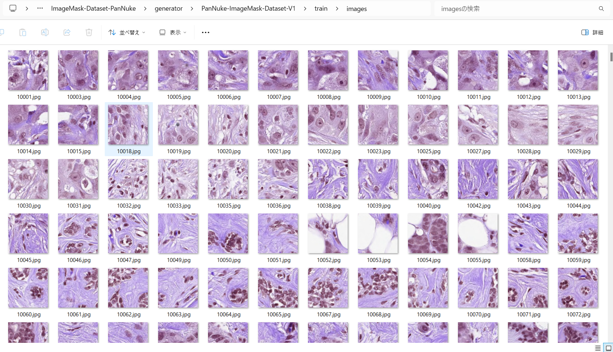
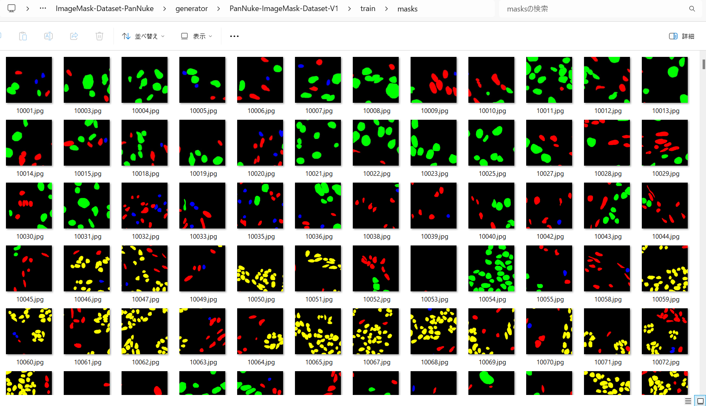
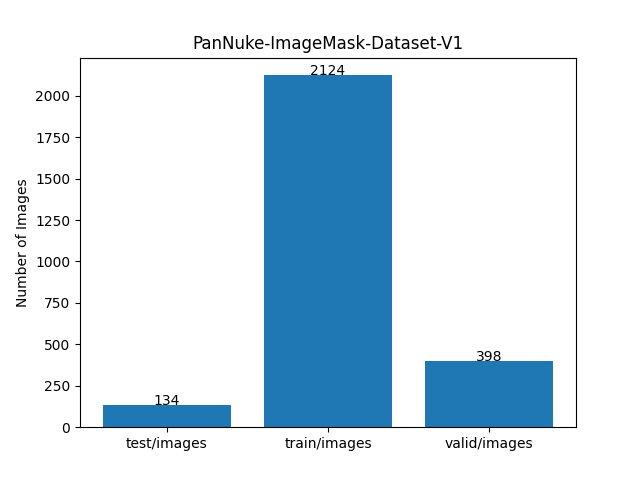

<h2>
ImageMask-Dataset-PanNuke (2024/04/09)
</h2>

This is PanNuke ImageMask Dataset. 

The image dataset used here has been taken from the following kaggle web site.
  
<b>Cancer Instance Segmentation and Classification 1</b> 
<pre>
https://www.kaggle.com/datasets/andrewmvd/cancer-inst-segmentation-and-classification
</pre>

We have uploaded the generated PanNuke-ImageMask-Dataset dataset to the google drive 
<a href="https://drive.google.com/file/d/13uTAf6xaighlVvZfhS1EA4PaQezNBRbe/view?usp=sharing">PanNuke-ImageMask-Dataset-V1.zip</a>.

<h3>1. Dataset Citation</h3>
The dataset used here has been taken from.
<pre>
https://www.kaggle.com/datasets/andrewmvd/cancer-inst-segmentation-and-classification
</pre>

About this Dataset 
<pre>
This dataset, also known as PanNuke, contains semi automatically generated nuclei instance segmentation and 
classification images with exhaustive nuclei labels across 19 different tissue types. The dataset consists 
of 481 visual fields, of which 312 are randomly sampled from more than 20K whole slide images at different 
magnifications, from multiple data sources.
In total the dataset contains 205,343 labeled nuclei, each with an instance segmentation mask. Models trained 
on PanNuke can aid in whole slide image tissue type segmentation, and generalize to new tissues.

More Medical Imaging Datasets
Part 1 (current)
Part 2
Part 3
More datasets
Acknowledgements
If you use this dataset in your research, please credit the authors:

Original Publications
@article{gamper2020pannuke,
title={PanNuke Dataset Extension, Insights and Baselines},
author={Gamper, Jevgenij and Koohbanani, Navid Alemi and Graham, Simon and Jahanifar, Mostafa and Benet, 
Ksenija and Khurram, Syed Ali and Azam, Ayesha and Hewitt, Katherine and Rajpoot, Nasir},
journal={arXiv preprint arXiv:2003.10778},
year={2020}
}

@inproceedings{gamper2019pannuke,
title={Pannuke: An open pan-cancer histology dataset for nuclei instance segmentation and classification},
author={Gamper, Jevgenij and Koohbanani, Navid Alemi and Benet, Ksenija and Khuram, Ali and Rajpoot, Nasir},
booktitle={European Congress on Digital Pathology},
pages={11--19},
year={2019},
organization={Springer}
}

Hovernet formated files were provided by chandlertimm with the available code here.

License
CC BY NC SA 4.0

Splash Image
Image by Otis Brawley released as public domain by National Cancer Institute, available here
</pre>

 
<h3>
2. Generate ImageMask Dataset 
</h3>
<h3>
2.1 Download master Part 1 dataset
</h3>
Please download master <b>Part 1</b> dataset from the following kaggle web site, and expand it under ./generator folder.  
<pre>
https://www.kaggle.com/datasets/andrewmvd/cancer-inst-segmentation-and-classification
</pre>
<b>Part 1</b> has the following folder structure.
<pre>
./generator
└Part 1
  ├─Author Notes
  ├─Images
  └─Masks
</pre>
<b>Images</b> and <b>Masks</b> folders contain numpy *.npy files.

<h3>
2.1 Create PanNuke-master dataset
</h3>
Please note that <b>masks.npy</b> file in Masks folder has six channels as shown below for each image in <b>images.npy</b>
in Image folder. 
<pre>
`masks.npy` an array of 6 channel instance-wise masks 
  0: Neoplastic cells, 
  1: Inflammatory, 
  2: Connective/Soft tissue cells, 
  3: Dead Cells, 
  4: Epithelial, 
  6: Background)
</pre>
Please move to ./generator folder and run Python script <a href="./generator/ImageMaskDatasetGenerator.py">ImageMaskDatasetGenerator.py</a><pre>
>python ImageMaskDatasetGenerator.py
</pre>
, by which the following folders will be created. 
<pre>
./generator
└PanNuke-master
  ├─images
  └─masks
</pre>

<h3>
2.3 Split master dataset 
</h3>
Please run Python script <a href="./generator/split_master.py">
split_master.py</a>
 to split the PanNuke-master into test, train and valid subdatasets, 
<pre>
>python split_master.py
</pre>

Finally, we have created the PanNuke-ImageMask-Dataset-V1. 
<pre>
./PanNuke-ImageMask-Dataset-V1
├─test
│  ├─images
│  └─masks
├─train
│  ├─images
│  └─masks
└─valid
    ├─images
    └─masks
</pre>

<b>train images sample</b> 
 
 

<b>train masks sample</b> 
 
 
<b>Dataset statistics</b> 
 
 

<h3>3. Download</h3>

You can download PanNuke-ImageMask-Dataset-V1 from the google drive 
<a href="https://drive.google.com/file/d/13uTAf6xaighlVvZfhS1EA4PaQezNBRbe/view?usp=sharing">PanNuke-ImageMask-Dataset-V1.zip</a>.

